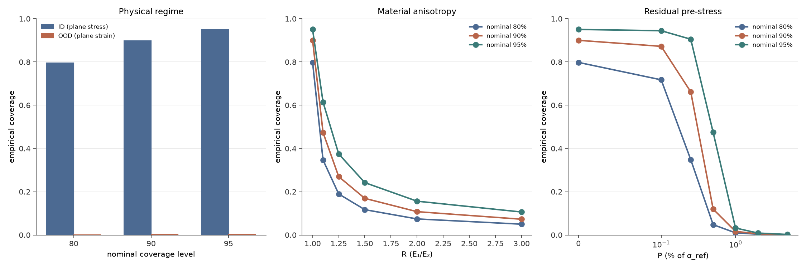
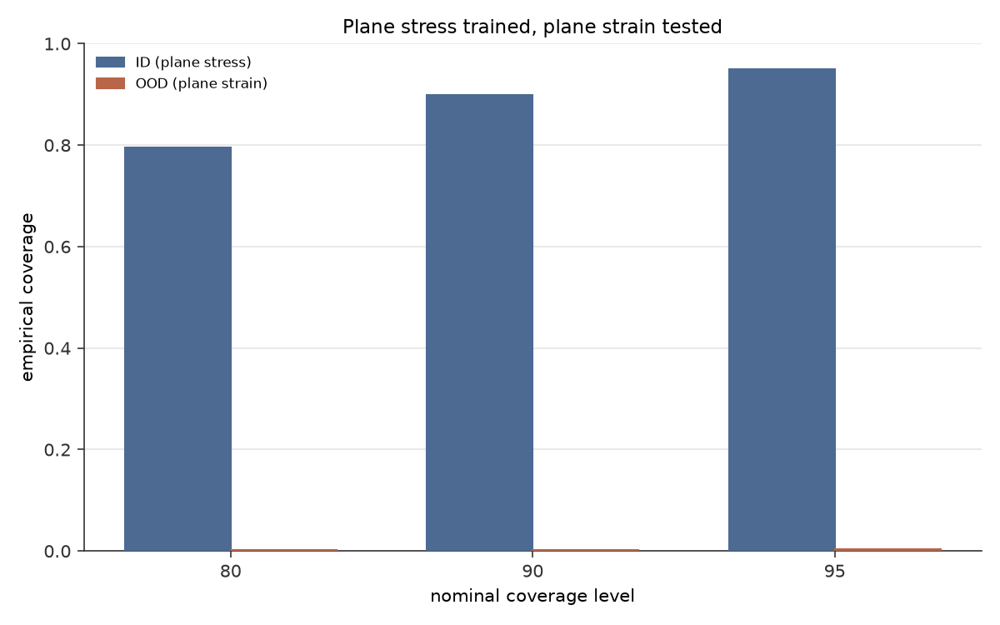
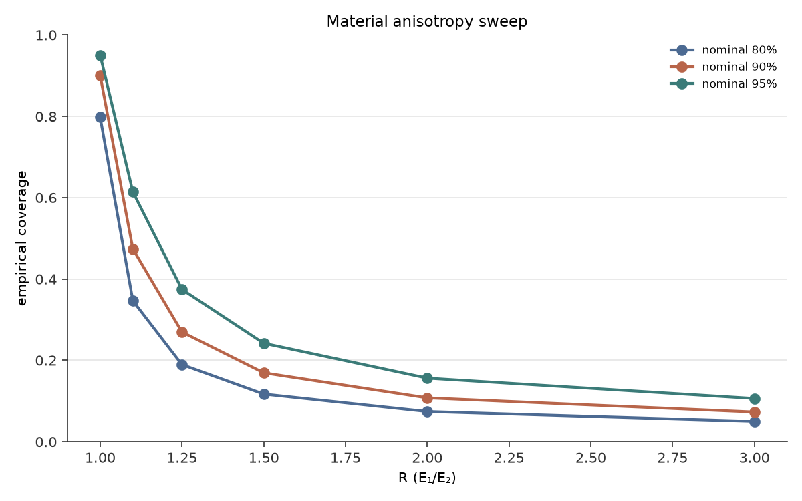
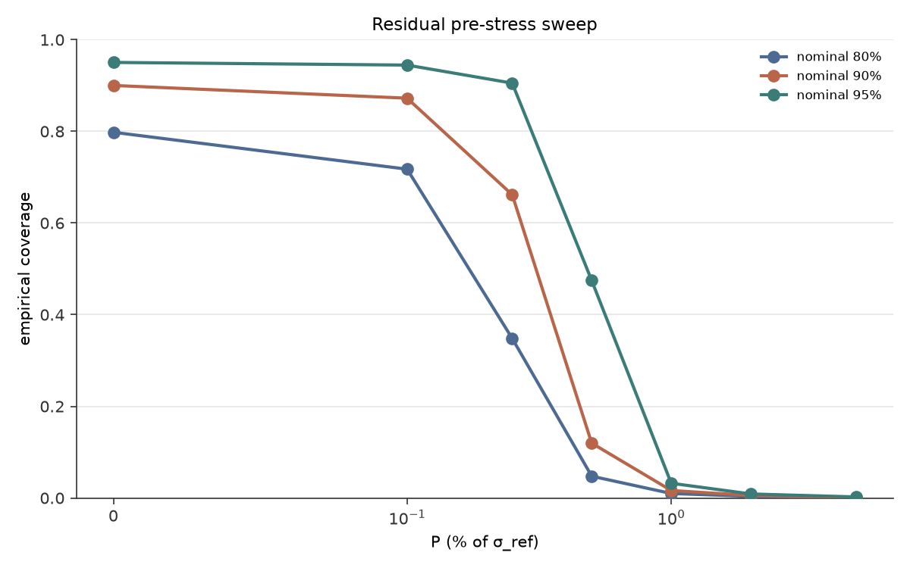

# FORGE

Flow-matching with cOnformal Rigour for Generative Elasticity.



FORGE is a study of when a generative surrogate model of 2D plate-with-hole stress fields can be trusted, and when it cannot. I trained a 9.7M-parameter DiT flow-matching model on 10,000 finite-element solutions of linear elastic plates under far-field tension, calibrated its predictions using split conformal prediction, and then measured how the calibrated coverage responds when the underlying physics is perturbed along three physically-meaningful axes that the model was never told about. The measurements span from severe categorical misspecification (plane stress trained, plane strain tested) where coverage collapses to 0.2% at nominal 90%, through graded material perturbation (isotropic trained, orthotropic tested) that produces a clean detection-and-saturation curve, to graded initial-condition perturbation (stress-free reference trained, pre-stressed tested) where a real detection floor is visible at 0.1% pre-stress and the diagnostic transitions cleanly through its dynamic range before saturating. The whole panel shares a single trained model and a single calibration threshold — only the test data changes across experiments.

## What this shows

Three experiments, one shared model, one shared calibration threshold.

### Physical regime: plane stress trained, plane strain tested

Categorical extreme misspecification. The model was trained on plane-stress FE solutions. Ground truth is plane-strain FE solutions with identical geometry, load direction, and load magnitude — only the constitutive assumption differs, and the model has no input channel to know which regime it's in.



| Nominal | ID (plane stress) | OOD (plane strain) |
|---|---|---|
| 80% | 0.7954 | 0.0013 |
| 90% | 0.8985 | 0.0020 |
| 95% | 0.9493 | 0.0031 |

Mean absolute residual: 0.001793 (ID) vs 0.208039 (OOD) in normalized units. The OOD MAR reconciles to within 3.5% of the independently-computed paired plane-stress vs plane-strain physical differential — a ratio of 1.035. The model behaves as an essentially perfect plane-stress predictor being scored against plane-strain ground truth, and the diagnostic reports exactly that.

### Material anisotropy sweep

Graded material misspecification. The model was trained assuming isotropic material (E=1, ν=0.3). Ground truth is orthotropic material with fixed fibers along the x-axis, holding all other physical parameters at their training values. The anisotropy ratio R = E₁/E₂ is the dial.



| R (E₁/E₂) | Cov@80 | Cov@90 | Cov@95 | MAR |
|---|---|---|---|---|
| 1.0 (control) | 0.7979 | 0.9005 | 0.9503 | 0.001758 |
| 1.1 | 0.3464 | 0.4739 | 0.6142 | 0.005543 |
| 1.25 | 0.1896 | 0.2697 | 0.3745 | 0.012056 |
| 1.5 | 0.1170 | 0.1693 | 0.2420 | 0.021573 |
| 2.0 | 0.0741 | 0.1077 | 0.1562 | 0.036768 |
| 3.0 | 0.0499 | 0.0728 | 0.1061 | 0.058281 |

The response is monotonic and strongly front-loaded. R=1.1 — a 10% stiffness ratio that is barely perceptible in engineering practice — accounts for more than 42 percentage points of coverage loss at nominal 90%. The diagnostic is extremely tightly bound to the trained material assumption. By R=1.5 the response has saturated toward its floor.

### Residual pre-existing stress sweep

Graded initial-condition misspecification. The model was trained assuming a stress-free reference state. Ground truth includes uniform biaxial pre-stress added to the plate before the applied load, corresponding to residual stress from manufacturing processes such as quenching or thermal contraction. Pre-stress magnitude P is expressed as a percentage of a nominal reference load σ_ref = 5×10⁻⁴.



| P (% of σ_ref) | Cov@80 | Cov@90 | Cov@95 | MAR |
|---|---|---|---|---|
| 0.0 (control) | 0.7979 | 0.9001 | 0.9504 | 0.001730 |
| 0.1 | 0.7175 | 0.8724 | 0.9446 | 0.001955 |
| 0.25 | 0.3481 | 0.6618 | 0.9052 | 0.002835 |
| 0.5 | 0.0475 | 0.1196 | 0.4744 | 0.004674 |
| 1.0 | 0.0098 | 0.0163 | 0.0321 | 0.008560 |
| 2.0 | 0.0035 | 0.0054 | 0.0088 | 0.016564 |
| 5.0 | 0.0010 | 0.0014 | 0.0023 | 0.041584 |

This experiment was designed to test three regimes simultaneously. At P=0.1% the coverage@95 gap from control is 0.006 — essentially at noise floor, demonstrating that the diagnostic has a real detection threshold and does not hallucinate misspecification when perturbation is genuinely small. Between P=0.25% and P=0.5% coverage transitions sharply across all three nominal levels. By P=1.0% the response has fully saturated. The three nominal-level curves also exhibit a sensitivity-ordering inversion: coverage@80 responds first at small P, but coverage@95's gap grows fastest at large P as its wider threshold is finally exceeded.

## The system

**Model.** DiT, 8 blocks, hidden dim 256, 4 attention heads, patch size 8, AdaLN-Zero conditioning, MLP ratio 4. Total 9,716,544 trainable parameters. Input channels: noisy state + SDF of the hole. Scalar conditioning: [r, σ_∞, sin(θ), cos(θ)]. Output: velocity field for flow matching. Architecture follows PBFM App G (Darcy scale) adapted for 64×64 stress fields.

**Training.** Conditional flow matching with OT paths (Lipman et al. 2023), σ_min = 10⁻³. AdamW, lr = 10⁻⁴, weight decay 0, EMA decay 0.999, gradient clip norm 1.0. 150,000 steps at batch 32 with 1,000-step linear warmup. Validation every 5,000 steps, checkpoint every 25,000. Total wall clock: 76.7 minutes on an RTX 4060 Laptop GPU (8GB), peak VRAM 558 MiB. Final train loss 0.008516, val loss 0.011806, EMA val loss 0.007535.

**Dataset.** 12,500 FE solutions across four splits: 10,000 training samples (plane stress, r/L ∈ [0.10, 0.30], σ_∞ ∈ [10⁻⁴, 10⁻³], θ ∈ [0°, 90°]), 1,000 ID test, 1,000 paired plane-strain OOD-fidelity, 500 r/L-extrapolated OOD-geometry. Halton-sampled. FE pipeline: gmsh mesh generation + dolfinx P2 linear elasticity solve → 64×64 von Mises stress grid. Physics validated against Kirsch analytical solution (small-hole limit) and Peterson stress concentration factor (finite-plate correction) to under 0.9% and 7% respectively.

**Calibration.** Split conformal prediction on per-pixel von Mises residuals. Nonconformity score: absolute residual of sample mean vs ground truth. M=500 generations per test point at 20 flow matching inference steps. Calibration on 500 held-out ID samples produces q_hat values of {0.001667, 0.002565, 0.003996} at nominal coverage levels {80%, 90%, 95%} in normalized units. These thresholds are locked and reused across all three experiments.

**Per-experiment test data.** The plane-strain experiment reuses the existing OOD-fidelity split (1,000 paired plane-strain samples). Anisotropy: 6 orthotropic test sets, 500 samples each (3,000 total). Residual pre-stress: 7 pre-stressed test sets, 500 samples each (3,500 total). Total new FE data generated for the panel: 6,500 samples.

## Getting started

```bash
git clone https://github.com/retroranger04/forge.git
cd forge

# Windows environment (PyTorch + evaluation)
pip install -r requirements-windows.txt

# WSL2 environment (FEniCSx + finite element solves)
# Uses micromamba
./bin/micromamba env create -f requirements-wsl.yaml -p .venv-wsl
```

The trained model checkpoint (`outputs/run_01/checkpoints/final.pt`) and per-experiment coverage results (`outputs/run_01/axis_*/coverage_results.json`) are large and not committed to the repository. Reproduce from scratch:

```bash
# Generate the base dataset (12,500 FE solutions across four splits)
python scripts/generate_dataset.py

# Train the flow-matching surrogate on 10,000 plane-stress samples
python scripts/train_run_01.py

# Calibrate the split conformal thresholds on held-out ID data,
# then measure coverage on ID and the plane-strain / geometry-extrapolation splits
python scripts/conformal_eval.py

# Material anisotropy experiment: generate 3,000 orthotropic test samples
# across six anisotropy ratios, then evaluate coverage
python scripts/generate_axis_anisotropy_sweep.py
python scripts/eval_axis_anisotropy_sweep.py

# Residual pre-stress experiment: generate 3,500 pre-stressed test samples
# across seven pre-stress magnitudes, then evaluate coverage
python scripts/generate_axis_residual_stress_sweep.py
python scripts/eval_axis_residual_stress_sweep.py
```

Compute cost varies significantly with hardware. The reference training run took roughly 77 minutes on an RTX 4060 Laptop GPU; other stages scale similarly with GPU throughput and CPU parallelism for the finite-element solves.

## File structure

```
.
├── README.md
├── LICENSE                                    # AGPL v3
├── pyproject.toml
├── requirements-windows.txt                   # Windows: PyTorch + evaluation
├── requirements-wsl.yaml                      # WSL2: FEniCSx + finite element solves
├── configs/
│   ├── run_01.yaml                            # Locked hyperparameters for the trained model
│   └── session_06_eval.yaml                   # Calibration and evaluation config
├── forge/
│   ├── models/
│   │   └── dit.py                             # DiT for 64x64 stress fields (PBFM App G)
│   ├── train/
│   │   └── flow_matching.py                   # OT-path flow matching loss and training loop
│   ├── data/
│   │   └── dataset.py                         # Split-scoped dataset with train-stat normalization
│   ├── fe/
│   │   └── generator.py                       # Single-sample FE pipeline (gmsh → dolfinx → grid)
│   ├── eval/
│   │   ├── sampling.py                        # Batched conditional FM sampling
│   │   ├── conformal.py                       # Split conformal on per-pixel VM residuals
│   │   └── coverage.py                        # Split-wise coverage evaluation
│   ├── logging.py                             # Tagged log format for parallel workers
│   └── watchdog.py                            # Worker attribution and stall detection
├── scripts/
│   ├── generate_dataset.py                    # Base dataset: 12,500 Halton-sampled FE solves
│   ├── train_run_01.py                        # Training entry point
│   ├── conformal_eval.py                      # ID calibration + ID/fidelity/geometry coverage
│   ├── generate_axis_anisotropy_sweep.py      # Anisotropy: 3,000 orthotropic test samples
│   ├── eval_axis_anisotropy_sweep.py          # Anisotropy coverage evaluation
│   ├── generate_axis_residual_stress_sweep.py # Residual stress: 3,500 pre-stressed test samples
│   ├── eval_axis_residual_stress_sweep.py     # Residual stress coverage evaluation
│   ├── check_pre_stress_physics.py            # Residual stress physics sanity check
│   ├── verify_axis_residual_stress_sweep.py   # Post-generation verification
│   └── eval_run_01.py                         # Post-training EMA validation + sample generation
├── tests/
│   ├── test_logging.py                        # Shared-log format contract tests
│   └── test_watchdog.py                       # Watchdog stall-detection tests
└── docs/
    └── figures/                               # Plots embedded in this README
```

## Design decisions

**Why auxiliary axes rather than direct-input extrapolation.** Perturbing an input the model was trained on (extrapolating θ beyond 90°, or extrapolating hole radius beyond training range) tests whether the model generalizes past its training distribution. That's a well-studied problem and mostly answers "no, models don't extrapolate." Perturbing an auxiliary variable — one the model has no input channel for and therefore cannot represent — tests something more interesting: whether the calibrated diagnostic can detect misspecification the model itself is structurally blind to. The three experiments here (physics regime, material anisotropy, residual stress) are all auxiliary in this sense. The model receives the same four scalars (r, σ_∞, sin θ, cos θ) plus the SDF regardless of which physical variable is perturbed. Any coverage response is the diagnostic detecting misspecification the model cannot see.

**Why flow matching rather than a deterministic surrogate.** The calibration procedure needs an ensemble of predictions per input to estimate residual distributions. A deterministic surrogate gives one prediction per input; getting an ensemble requires either training multiple models (expensive) or Monte Carlo dropout (approximate). A generative surrogate produces an ensemble by design — draw M samples from the conditional distribution at each input and use their empirical distribution to construct nonconformity scores. Flow matching is a specific choice within generative modeling that trains stably, samples efficiently, and has strong recent results on physics fields (PBFM). Diffusion would also work but flow matching's OT paths give straighter trajectories at inference.

**Why split conformal rather than other UQ methods.** Split conformal prediction has a rare property: it produces distribution-free coverage guarantees given only the assumption that calibration and test data are exchangeable. No Gaussian assumptions on residuals, no correctness assumptions about the underlying model. The guarantee is finite-sample. This makes it a natural diagnostic — when coverage degrades on a test distribution, the exchangeability assumption is what's broken, and that's a specific and interpretable failure mode.

**Why a single trained model shared across experiments.** The panel's central claim is about the diagnostic, not about the surrogate. Using one model across all three experiments controls for model variability and makes the coverage differences attributable to the physical variable being perturbed rather than to different training runs. This shared-model design means the three experiments are directly comparable to each other on a common baseline (the R=1.0 control in anisotropy and the P=0.0 control in residual stress both reproduce ID coverage to within 0.005 of nominal).

## What this shows and doesn't

The diagnostic detects auxiliary physical misspecification along three qualitatively distinct axes. It produces different signatures for different failure modes: categorical collapse for regime change, steep-then-saturated response for material anisotropy, three-regime response (floor, transition, saturation) for graded initial-condition perturbation. Coverage tracks these signatures with dynamic range concentrated in the small-perturbation region.

This work does not compare split conformal against alternative UQ approaches (ensembles, evidential learning, Bayesian methods). It does not test the diagnostic on 3D problems, on nonlinear elasticity, on other geometries, or on other loading types. The trained surrogate has known limits — plane strain fields are 116× harder for the calibrated intervals than plane stress fields — and this project quantifies those limits rather than closing them. Extending the surrogate's competence beyond its training distribution is not attempted here; the interesting question addressed is what the calibration can detect, not how to fix what it flags.

## Future directions

The diagnostic signal has instrumental value beyond deployment-time trust. If an FE solver can be run selectively on inputs the diagnostic flags as misspecified, those cases become labeled examples of "the current model's assumptions don't match reality here." An active-learning loop — use the diagnostic as an acquisition function, expand training data at flagged inputs, retrain — would iteratively expand the surrogate's reliable-operation envelope while spending expensive full-solver compute only where it's most informative. The diagnostic thus serves not just as a deployment-time trust signal but as the sensor of an adaptive model improvement loop. Building that loop is out of scope for this project but is where I think the natural continuation lives.

## References

Angelopoulos, A. N., & Bates, S. (2023). *A Gentle Introduction to Conformal Prediction and Distribution-Free Uncertainty Quantification.*

Lipman, Y., Chen, R. T. Q., Ben-Hamu, H., Nickel, M., & Le, M. (2023). *Flow Matching for Generative Modeling.* ICLR 2023.

Peebles, W., & Xie, S. (2023). *Scalable Diffusion Models with Transformers.* ICCV 2023.

Thuerey, N., Holl, P., Mueller, M., Schnell, P., Trost, F., & Um, K. (2022). *Physics-based Deep Learning.* [https://physicsbaseddeeplearning.org/](https://physicsbaseddeeplearning.org/)

## License

AGPL v3. See `LICENSE` for details. Academic use is unrestricted.
Derivative works redistributed as software or offered as a network service must be released under AGPL v3, including making the source code available to users of the service.

## Contact

Arpit Mathur — retroranger24@gmail.com

## Citation

If this work is useful in your research, please cite as:

```bibtex
@misc{mathur2026forge,
  author = {Arpit Mathur},
  title = {FORGE: Flow-matching with Conformal Rigour for Generative Elasticity},
  year = {2026},
  publisher = {GitHub},
  url = {https://github.com/retroranger04/forge}
}
```